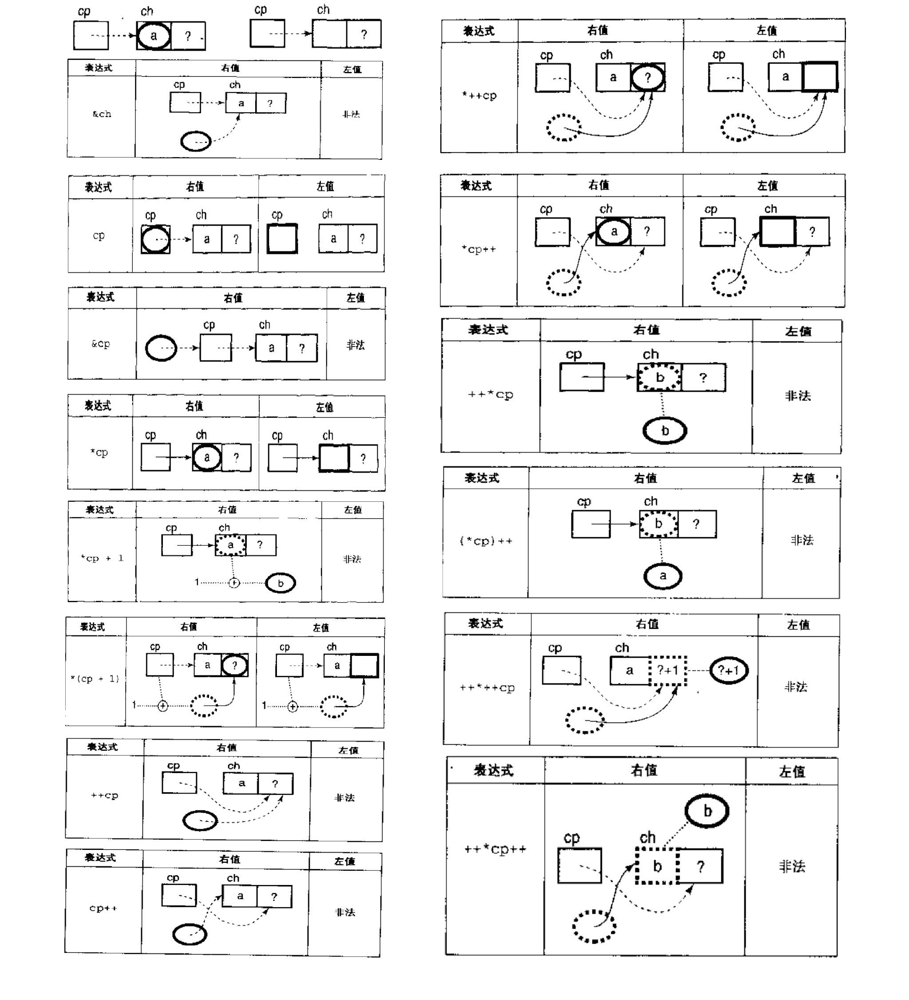
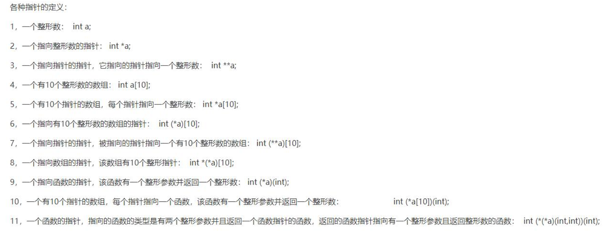
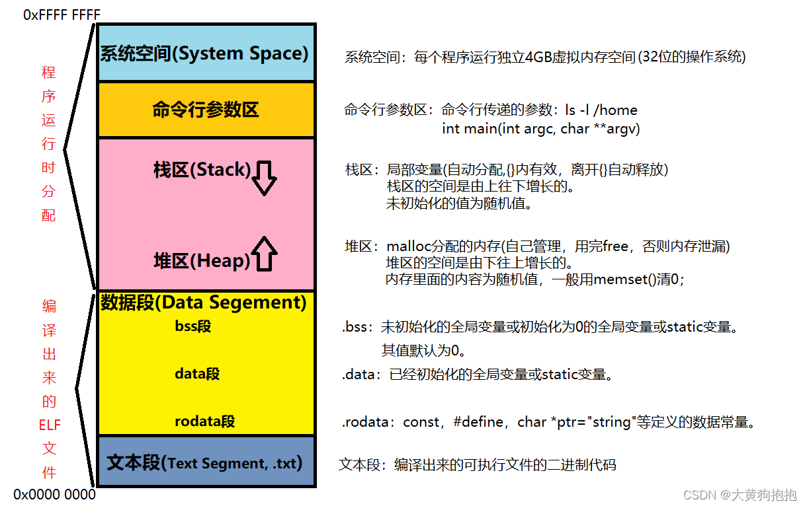
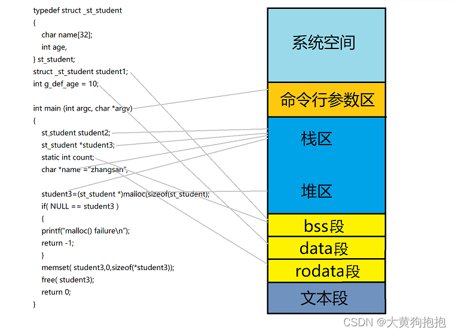
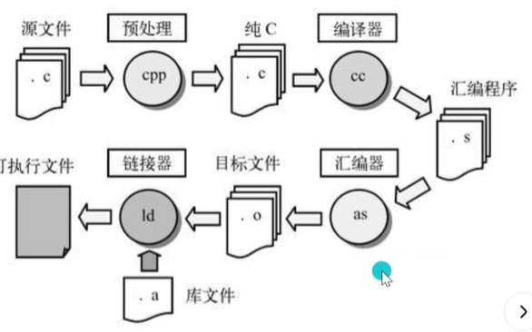
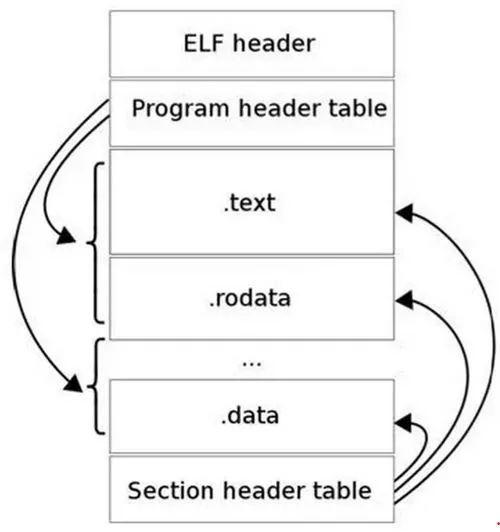

[TOC]

# ==C基础知识==

## ==标识符==

``` c
extern	声明变量是在其他文件正声明
typedef	用以给数据类型取别名
auto	声明自动变量
static	声明静态变量int声明整型变量或函数
const	声明只读变量
volatile	说明变量在程序执行中可被隐含地改变long声明长整型变量或函数
register	声明寄存器变量
```
- extern

  - Q&A: **extern "C"**的作用
    - 是告诉**C++编译器**用C规则编译指定的代码（除函数重载外，**extern “C”**不影响C++其他特性）


  - ```c
    //区分
    char *filename = "aaa";
    extern char *filename;
    
    char filename[] = "aaa";
    extern char filename[];
    ```


- typedef

  - 常规用法

    - ```c
      typedef char* PCHAR1;
      typedef struct Books
      {
         char  title[50];
         char  author[50];
         char  subject[100];
         int   book_id;
      }Book;
      typedef int (*fun_ptr)(int,int); // 声明一个指向同样参数、返回值的函数指针类型
      ```


  - Q&A: **typedef**和**#define**

    - **#define** 是 C 指令，用于为各种数据类型定义别名，也能为数值定义别名

    - **typedef** 仅限于为类型定义符号名称

    - **typedef** 是由编译器执行处理的，**#define** 语句是由预编译器进行处理的。

    - **typedef作用域**

      - 如果放在所有函数之外，它的作用域就是从**它定义开始直到文件尾**
      - 如果放在某个函数内，它的作用域就是从**它定义开始直到该函数结尾**

    - **#define作用域**

      - 不管是在某个函数内，还是在所有函数之外，作用域都是从定义开始直到整个文件结尾（不管是typedef还是define，其作用域都不会扩展到别的文件，即使是同一个程序的不同文件，也不能互相使用）

    - ```c
      typedef char* PCHAR1;
      #define PCHAR2 char *
      
      PCHAR1 c1,c2;//c1和c2都是指针
      PCHAR2 c3,c4;//c3是指针，c4不是指针
      ```


- auto
  - 动态存储，如果不赋初值，将是一个不确定的值。


- static

  - 修饰全局变量
    - **静态全局变量**（存放在数据段(.data段/.bss段)）仅对当前文件可见，其他文件不可访问，其他文件可定义相同变量名，两者互不影响

    - 修饰局部变量
      - **静态局部变量**（存放在数据段(.data段/.bss段)）初始化为0，运行一开始开辟内存，内存放在全局，增加了变量的存活时间与函数的堆栈区不在同一个区域，因此函数运行完毕后静态局部变量不会被释放。
      - **静态局部变量**只赋一次初值。下次使用静态局部变量的时候直接使用上次保存下来的值而不会重新赋值。
    
    
    - 修饰函数
      - **静态函数**只能在声明它的文件中可见，其他文件不能引用该函数，其他文件函数名可相同，是对函数本身的一种保护机制。
    

  - 头文件中定义静态变量
    - 含该头文件的源文件会有命名相同但实际不同的静态变量


- const

  - 修饰普通变量

    ```c
    const int a = 100;int const a = 100;//常量、定义同时必须初始化
    const int MaxNum1 = getNum();  //运行时初始化
    const int MaxNum2 = n;         //运行时初始化
    const int MaxNum3 = 80;        //编译时初始化
    ```


  - 修饰指针

    ```c
    //const 离变量名近就是用来修饰指针变量的，离变量名远就是用来修饰指针指向的数据，如果近的和远的都有，那么就同时修饰指针变量以及它指向的数据。
    const int *p;//修饰指针指向的数据只读-----常用来作为形参指针
    int const *p;//修饰指针指向的数据只读
    int * const p;//修饰指针变量
    const int * const p;int const * const p;//两者
    const char **       // 是一个指向指针的指针，那个指针又指向一个字符串常量。   
    char **             // 也是一个指向指针的指针，那个指针又指向一个字符串变量。
    ```

    - 不能将const char *类型的数据赋值给char *类型的变量。但反过来是可以的，编译器允许将char *类型的数据赋值给const char *类型的变量。


  - 全局常量（静态存储区）、局部常量（栈）、const修饰的字符串常量（常量存储区）


  - Q&A:const + volatile 为只读状态寄存器


- volatile

  - 防止被优化（意想不到的改变）优化器在用到这个变量时必须每次都小心地重新读取这个变量的值,而不是使用保存在寄存器里的备份。

    ```c
    //注意要把常量转换成无符号整形指针的数据类型，一般还要加 volatile 防止被优化
    volatile unsigned int *p = (volatile unsigned int *)0x000051EF;
    printf("p = 0x%p\n", p);
    ```


  - 中断服务程序中修改的供其它程序检测的变量需要加volatile，也可以使用关键区保护；


  - 多任务环境下各任务间共享的标志应该加volatile，也可以关闭系统调度；


  - 存储器映射的硬件寄存器通常也要加volatile说明，因为每次对它的读写都可能有不同意义。


  - 理解为直接存取原始内存地址


  - Q&A:当一个中服务子程序修该一个指向一个buffer的指针时，buffer应加volatile


- register
  - 会优先存储在CPU寄存器中（但不一定会存储在寄存器中，因为寄存器数量是有限的），而且该变量不能使用取地址符(&)


```c
void	声明函数无返回值或无参数，声明无类型指针float声明浮点型变量或函数
signed	声明有符号类型变量或函数
unsigned	声明无符号类型变量或函数
char	声明字符型变量或函数
short	声明短整型变量或函数
int		声明整型变量或函数
long    声明长整型变量或函数
float	声明单精度变量或函数
double	声明双精度变量或函数
struct	声明结构体变量或函数
union	声明共用数据类型
enum	声明枚举类型
```

- 数据类型

  - float和double的存储
    - 1 + 8 + 23、1 + 11 + 52

  - Q&A:判断两个浮点数相等（和0做比较）
    - float 6~7位有效数字，double 15~16位有效数字


- struct
  - 略


- union
  - 共用体占用的内存应足够存储共用体中最大的成员，共用体赋值会导致覆盖。


- enum

  - 第一个枚举成员的默认值为整型的 0，后续枚举成员的值在前一个成员上加 1。

    ```c
    enum season {spring, summer=3, autumn, winter}; //0 3 4 5
    ```


  - 内存大小一般小于1个int类型数


``` c
for	一种循环语句do循环语句的循环体
do 
while	循环语句的循环条件
if	条件语句
else	条件语句否定分支（与 if 连用）
switch	用于开关语句
case	开关语句分支
goto	无条件跳转语句
break	结束当前循环，跳出当前循环
continue	结束当前循环，开始下一轮循环
default	开关语句中的其他分支
```

- if-else

  - 赋值后判断

    ```c
    if((filedesc = open(argv[i],0)) < 0)
        error();
    ```


  - if-else匹配问题

    ```c
    if (x == 0)
        if(y == 0) error();
    else{
        z = x + y;
        f(&z);
    }
    //等价于
    if (x == 0){
        if(y == 0) error();
        else{
            z = x + y;
            f(&z);
        }
    }
    ```

  - **if else的优缺点**

    - if else的优点：if else能应用于更多的场所以if else比较灵活。

    - if else的缺点：if else必须遍历所以的可能值。

- switch

  - break匹配输出问题

  - **switch case的优缺点**
    - switch case的优点：
      1. 当分支较多时，用switch的效率是很高的。因为switch是确定了选择值之后直接跳转到那个特定的分支.
    - switch case的缺点：
      1. switch...case占用较多的代码空间，因为它要生成跳表，特别是当case常量分布范围很大但实际有效值又比较少的情况，switch...case的空间利用率将变得很低。
      2. switch...case只能处理字符或者数字类型的变量的情况。


- while

  ```c
  int k = 10;
  while(--k >= 0)
  ```

## ==基本数据类型==

linux系统下的字节数，windows64位下的long(int)和unsigned  long(int)均为4个字节。

|      DataType       |   16    |   32    |   64    |
| :-----------------: | :-----: | :-----: | :-----: |
|        char         | 1个字节 | 1个字节 | 1个字节 |
|    short（int）     | 2个字节 | 2个字节 | 2个字节 |
|         int         | 2个字节 | 4个字节 | 4个字节 |
|    unsigned int     | 2个字节 | 4个字节 | 4个字节 |
|        float        | 4个字节 | 4个字节 | 4个字节 |
|       double        | 8个字节 | 8个字节 | 8个字节 |
|      long(int)      | 4个字节 | 4个字节 | 8个字节 |
|   long long(int)    | 8个字节 | 8个字节 | 8个字节 |
| unsigned  long(int) | 4个字节 | 4个字节 | 8个字节 |
|        指针         | 2个字节 | 4个字节 | 8个字节 |
|        数组         |         |         |         |
|       结构体        |         |         |         |
|     结构体-位域     |         |         |         |
|       联合体        |         |         |         |
|         类          |         |         |         |

- 047和47不同：047是八进制数、47是十进制数
- ascii码：
  - \n是换行，英文是New line，换行就是把滚筒卷一格，不改变水平位置。
  - \r是回车，英文是Carriage return，回车就是把水平位置复位，不卷动滚筒。
  - Enter = 回车+换行(\r\n)   注:\r\n连用时,  不能调换顺序
    - Unix换行：\n(0x0A)
    - MAC回车：\r(0x0D)

    - WIN回车换行：\r\n(0x0D,0x0A)


## ==作用域==

- 代码块作用域：{}

- 文件作用域：文件内部

- 原型作用域：函数原型中声明的参数名
- 函数作用域

## ==操作符与表达式==

- 左值和右值

- 类型转换
  - 隐式类型转换
  - 类型强转
- 优先级和求值顺序和表达式的值
  - 单目运算符、双目运算符（算数运算符、移位运算符、关系运算符、逻辑运算符、赋值运算符）、条件运算符、逗号运算符
    - 后缀++：先返回一份拷贝，再增加操作数的值，表达式的值是原指针的一份拷贝
    - ++前缀：先增加操作数的值，再返回这个结果，表达式的值是增值后指针的一份拷贝
    - 逗号表达式：从左到右逐个计算，表达式的值为最后一个表达式的值
- 贪心法
  - C编译器规则：每一个符号应该包含尽可能多的字符。
- 短路原则

## ==数组与指针==

- 类型转换符（）

  - 知道如何声明一个给定类型的变量，只需要把声明中的变量名和末尾的分号去掉，再整体括号起来就是该类型的类型转换符

  ```c
  float (*fp)();//(float (*)()) 为指向返回值为浮点类型的函数的指针
  (*fp)();//等价于fp() 即调用了fp指向的函数
  
  //eg1.调用首地址为0的子例程
  (*(void (*)())0)();
  //或者
  typedef void (*funcptr)();
  (*(funcptr)0)();
  
  //eg2.signal函数 接受被捕获signal的整数值，然后用回调函数调用他
  void (*signal())(int);//调用signal，并对其函数指针类型的返回值解引用，然后传递一个整型参数调用解引用所得到的函数，最后返回void类型；
  void (*signal(int, void (*)(int)))(int);
  //或者
  typedef void (*HANDLER)(int);
  HANDLER signal(int HANDLER);
  ```

- 数组理解：只有一维数组、要确定数组大小、以及获得指向该数组下标为0的元素的指针

  - 指针常量（数组解释）、常量指针

  - ```C
    int day[30];
    //day是一个数组，大小为30，day指向该数组下标为0的元素的指针即&day[0]（除被用作sizeof参数外）
    //*day是指向该数组下标为0的元素的引用day[0]  ---->*(day + i) = day[i]
    //故将数组作为参数无意义，char s[] 等价于 char*s、char *argv[]等价于char **argv
    //区分extern char *hello;和extern char hello[];
    int calendar[12][31];
    //calendar是一个数组，拥有12个数组类型的元素，每个元素拥有31个int类型的元素
    //calendar转换为指向数组的指针
    //----->*(*(calendar + month) + day) = calendar[month][day]
    //二级指针遍历二维数组
    int (* monthp)[31];
    for(monthp = calendar; monthp < &calendar[12]; monthp++){
        int *dayp;
        for(dayp = *monthp;dayp < &(*monthp)[31]; dayp++){
            *dayp = 0;
    	}
    }
    ```

- Q&A：指针和数组的效率

  - 指针

- 指针运算：++、–、+、-、关系运算符

- 字符串常量

  strlen只计算字符串所包括的字符数目，sizeof计算包括作为结束标志的空字符

- 空指针

  空指针非空字符串、空指针不能被解引用（除用来判断if(p ==  (char *) 0)）

- 间接访问运算符/解引用指针

  - 解引用表示访问指针变量所存放的内存地址、并查看里面的值
    - 即左值是指针变量所存放的内存地址，右值是左值地址上的值


- >  

- 二级指针、数组指针、指针数组、函数指针、指针函数、函数指针数组、结构体指针、结构体指针数组
  - 
  - 二级指针：二级指针不能指向二维数组
  - 函数指针：

## ==函数==

- 函数参数
  - 一维数组形参：等同于指针
  - 二维数组形参：只能数组指针来接受其二维数组地址
  - 回调函数：函数指针来接受回调函数
    - 回调机制允许下层软件层调用上层软件层定义的函数。
    - 事件回调、寄存器中的多个回调
    - 函数指针可能会阻止编译器执行的一些优化（函数内联）
- 可变参数列表
  - stdarg宏
    - va_list 、va_start、va_arg、va_end

## ==字符串==

### 字符串函数

```c
#include <string.h>
char *p = "hello";
//输出字符串
puts(p);
//输入字符串
char str[128] = "\0";   //字符数组初始化\0
scanf("%s", str);
gets(str); //
getchar(s);
//复制字符串 表示把src所指向的字符串中以src地址开始的前n个字节复制到dest所指的数组中，并返回被赋值后的dest。
char *strncpy(char *dest, const char *src, int n);
//拼接字符串 把src所指向的字符串（包括“\0”）复制到dest所指向的==字符串后面==（删除`*dest`原来末尾的“\0”）。要保证`*dest`足够长，以容纳被复制进来的`*src`。`*src`中原有的字符不变。返回指向dest的指针。
char *strcat(char *dest, const char *src);
//比较字符串 若str1=str2，则返回零；若str1<str2，则返回负数；若str1>str2，则返回正数
int strcmp(const char *s1,const char *s2);
int strncmp (const char * str1, const char * str2, size_t n );
//void memset(首地址, 值, sizeof(地址总大小));
void *memset(void *s, int c, unsigned long n);
```

- 字符数组和字符串

  - ```c
    char str[] = "hello";   //字符串数组，可以修改数组内容
    char *pchar = "hello";  //字符串指针变量，此时的"hello"为字符串常量，不能再通过指针来修改其内容
    ```

## ==结构体==

### 结构体定义初始化

- 指定初始化（顺序随意）

  ```c
  static struct usb_driver usb_storage_driver = {   
      .owner = THIS_MODULE,      
      .name = \"usb-storage\",      
      .probe = storage_probe,      
      .disconnect = storage_disconnect,      
      .id_table = storage_usb_ids, }; 
  
  struct A a;
  //错误赋值
  a = {1,2};
  //正确赋值
  struct A a = {1,2};
  ```

- 访问方式

  - 通过结构体变量名访问，用点（成员选择（对象））运算符

    - 通过结构体指针间接访问，先取内容为结构体，然后用点（成员选择（对象））运算符

      - ```c
        (*p).idata;  //点的优先级比*高，需要加括号
        ```

  - 通过结构体指针间接访问，用->（成员选择（指针））运算符

### 结构体数组初始化

- ```c
  struct student
  {
      int mum;
      char name[20];
      char sex;
      int age;
      float score;
      char addr[30];
  }stu[3] = {{10101,"Li Lin", 'M', 18, 87.5, "103 Beijing Road"},
              {10101,"Li Lin", 'M', 18, 87.5, "103 Beijing Road"},
              {10101,"Li Lin", 'M', 18, 87.5, "103 Beijing Road"}};
  struct student stu[3];
  ```

### 结构体之位域

- 一个位域必须存储在同一个字节中，不能跨两个字节。

- 位域可以无位域名，这时它只用来作填充或调整位置。无名的位域是不能使用的。

- ```c
  struct bs  
  {  
      unsigned a:4  
      unsigned b:5 /*从下一单元开始存放*/  
      unsigned c:4  
  }
  struct k  
  {  
      int a:1  
      int :2 /*无位域名，该2位不能使用*/  
      int b:3  
      int c:2  
  };
  ```

## ==通用库、标准输入输出==

| 标准文件 | 文件指针 | 设备     |
| :------- | :------- | :------- |
| 标准输入 | stdin    | 键盘     |
| 标准输出 | stdout   | 屏幕     |
| 标准错误 | stderr   | 您的屏幕 |

### 缓冲区

- 输入缓冲区和输出缓冲区

- 全缓存：==缓冲区被填满以后才进行真正的输入输出操作==

  - 将数据写入文件后，打开文件并不能立即看到内容，只有清空缓冲区，或者关闭文件，或者关闭程序后，才能在文件中看到内容。

- 行缓冲：==在输入或者输出的过程中遇到换行符时，才执行真正的输入输出操作==

  - 键盘（scanf、getchar、gets）和显示器（Linux的printf、puts、putchar）

  - ```c
    printf("C语言中文网");
    sleep(5);  //程序暂停5秒钟
    printf("http://c.biancheng.net\n");//两个printf一起输出
    ```

- 不带缓存

  - Windows的getche和getch、Windows的printf和puts和putchar、perror

- 刷新缓冲区

  - 不管是行缓冲还是全缓冲，缓冲区满时会自动刷新；
  - 行缓冲遇到换行符`\n`时会刷新；
  - 关闭文件时会刷新缓冲区；
  - 程序关闭时一般也会刷新缓冲区，这个是由标准库来保障的；
  - 使用特定的函数也可以手动刷新缓冲区，例如 fflush()。
  - 

### 常用函数

```c
int printf(const char *format, ...);//printf()函数中，从右往左计算
int puts(const char *s);//函数把字符串s和一个尾随的换行符写入到stdout
putchar('abc'); // 输出字符'c' ，多个字符时输出最后一个字符，返回同样的字符
int scanf(const char *format, ...);//空格、回车也是字符
	scanf("%[^\n]%*c", str);//碰见了回车就退出，然后把缓冲区里面的内容按字符串格式输入str中，回车依然留在缓冲区
	scanf("%*[^0-9]");//读取非数字，但是不向任何地方输入
int getchar(void);//getchar返回一个整数
char *gets(char *s);//从stdin读取一行到s所指向的缓冲区，直到一个终止符或 EOF，可能会导致缓冲区溢出
fgets();//代替gets
void qsort(void *, size_t, size_t, int (comp*)(const void *, const void *));
```

### 格式化输出

- %s、%d、%c、%f 等来输出或读取字符串、整数、字符或浮点数

## ==段错误==

### 段错误产生原因

- 访问不存在的内存地址
- 访问只读的内存地址
- 访问系统保护的内存地址
- 栈溢出

### 调试方法

- ```
  $ gcc -g -o test test.c
  $ gdb ./test
  ```

## ==C面向对象==

### 多态

- ```c
  struct ShapeVtbl;
  // Shape 的属性
  typedef struct {
      struct ShapeVtbl const *vptr;//虚指针
      int16_t x; 
      int16_t y; 
  } Shape;
  // Shape 的虚表
  struct ShapeVtbl {
      uint32_t (*area)(Shape const * const me);
      void (*draw)(Shape const * const me);
  };
  //构造函数中的虚表
  // Shape 类的虚表
  static struct ShapeVtbl const vtbl = 
  { 
      &Shape_area_,
      &Shape_draw_
  };
  ```


## ==内存分配问题==

### 野指针

- 悬挂指针：指针指向的内存被删除
- 野指针：指针变量未初始化，指针free后未置空，超出作用范围；指针被创建缺省值是随机的。

### strcpy与memcpy的区别

- strcpy 是依据 "\0" 作为结束判断的，如果 dest 的空间不够，则会引起 buffer overflow。
- memcpy用来在内存中复制数据，由于字符串是以"\0"结尾的，所以对于在数据中包含"\0"的数据只能用memcpy。（通常非字符串的数据比如结构体都会用memcpy来实现数据拷贝）
- strncpy和memcpy很相似，只不过它在一个终止的空字符处停止。当n>strlen(src)时，给dest不够数的空间里填充"\0“；当n<=strlen(src)时，dest是没有结束符"\0“的。这里隐藏了一个事实，就是dest指向的内存一定会被写n个字符。使用strncpy时，确保s2的最后一个字符是"\0”。
- strcpy只是复制字符串，但不限制复制的数量，很容易造成缓冲==溢出==。strncpy要安全一些。strncpy能够选择一段字符输出，strcpy则不能。

### 大小端存储

- 大小端存储转换

  ```c
  #define swap_endian_u16(A) (((A) & 0xFF00 >> 8) | ((A) & 0x00FF << 8))
  ```

- 字节序和位序
  - 0x12345678  大端存储高到低（78、56、34、12）（00110000）
  - 0x12345678  小端存储高到低（12、34、56、78）（00001100）

### 内存对齐

- 什么是内存对齐
  - 要求数据的首地址的值是某个数k（通常它为4或8）的倍数

- 为什么要内存对齐
  - 加快cpu访问内存的速度

- 内存存取粒度
  - 处理器存取单元

- 对齐系数和对齐单位

  - gcc中默认#pragma pack(4)、linux下默认#pragma pack(4)

  - 对齐单位
    - #pragma pack(n)和结构体中最长数据类型长度中较小值

- 内存对齐规则

  - **数据成员对齐规则**：结构（struct）（或联合（union））的数据成员，第一个数据成员放在offset为0的地方，以后每个数据成员存储的起始位置要从该成员大小或者成员的==子成员大小==（只要该成员有子成员，比如说是数组，结构体等）的整数倍开始（比如int在32位机为4字节，则要从4的整数倍地址开始存储）。

  - **结构体作为成员**：如果一个结构体里有某些结构体成员，则结构体成员要从其内部最大元素大小的整数倍地址开始存储（struct a 里存有struct b，b里有char，int，double等元素，那么b应该从8的整数倍开始存储）。

  - **收尾工作**：结构体的总大小，也就是sizeof的结果，必须是其内部最大成员的整数倍，不足的要补齐。

- 结构体之位域的对齐

  - 如果相邻位域字段的类型相同，且其位宽之和小于类型的sizeof大小，则后面的字段将紧邻前一个字段存储，直到不能容纳为止

  - 如果相邻位域字段的类型相同，但其位宽之和大于类型的sizeof大小，则后面的字段将从新的存储单元开始，其偏移量为其类型大小的整数倍

- C++中的类

  - 类中没有成员从称空类，sizeof(空类)=1，类中成员函数不占空间，除非是虚函数

  - 若类中包含成员，则仅算非静态成员对齐后的空间，同结构体对齐

  - 若类中包含虚函数，则sizeof(数据成员)的和+sizeof(虚表指针，为4)

  - 对于继承父类的子类，为父类成员+子类成员对齐后所占空间

  - 若子类和父类都有虚函数，父类成员+子类成员+sizeof(虚表指针，为4)

  - 若是虚继承的子类，父类成员+子类成员+指向父类的指针(4)

  - 若是虚继承有虚函数的子类，父类成员（+虚表指针4）+子类成员（+虚表指针4）+指向父类的指针（4）

### 内存分区

- 5分区（4分区将BSS段和数据段合并为静态存储区）

  - BSS段( bss(Block Started by Symbol) segment )(.bss)：静态内存分配

    - 未初始化的全局变量和静态变量（初始化为0的呢？）
    - 在运行时分配并被有效地清零（==隐式初始化为0==）
    - BSS节在应用程序的二进制映象文件中并不存在,即==不占用磁盘空间==而只在运行的时候占用内存空间

    - 数据段(data segment)：静态内存分配

      - 已经初始化的全局变量和静态变量（.data）

      - 包括只读数据段（.rodata）和读写数据段

        1.只读数据段：字符串常量

    - 代码段(code segment/text segment)(.text)
      - 程序执行代码

    - 堆(heap)：动态内存分配
      - 进程调用malloc等函数分配内存，利用free等函数释放内存
      - 堆内存运行时分配的，堆区是由下往上增长，分配随机值一般用memset（）清0

  - 栈 (stack)：动态内存分配
    - 存放函数的参数以及局部变量，但不包括static声明的局部变量，故未初始化的局部变量是随机值
      - 函数被调用时,其参数也会被压入发起调用的进程栈；调用结束后,函数的返回值也会被存放回栈
      - 先进先出，保存/恢复调用现场
      - 栈内存编译阶段完成，栈区空间是由上往下增长

### 内存布局（4G虚拟地址空间 32为操作系统）





## ==编译器==

- 编译器将内存和名字关联起来
- 编译过程：>

### 预编译

- 宏(#define、#unde、#ifdef、#ifndef、#elif、#else、\#endif)

  - 不能忽视宏中的空格

  - 宏不是函数，自增需要注意

  - 断言宏

    - ```c
      #define assert(e)\
      		((void)((e)||_assert_error(__FILE__,__LINE__)))
      //那么它先向 stderr 打印一条出错信息,然后通过调用 abort 来终止程序运行。
      //使用 assert 的缺点是，频繁的调用会极大的影响程序的性能，增加额外的开销。
      ```

  - #ifndef
    - 与#prama once 不同的是其不仅是“物理上”的同一个文件，而且是内容相同的文件。

  - #pragma

    - #pragma once

      - 预编译会保留所有的#pragma编译器指令，后续编译过程需要使用它们。

      - 避免同一个头文件被包含多次（“物理上”的同一个文件）

      - 避免了名字冲突、但兼容性不好

    - #pragma pack(n) n = 1,2,4,8,16

  - defined函数
    - defined （宏名）被定义返回1，未被定义返回0

- 条件编译

  ```c
  #if 整型常量表达式1
    程序段1
  #elif 整型常量表达式2
    程序段2
  #else
    程序段3
  #endif
  ```

- 头文件

  ```c
  #include <stdio.h> //编译器会到系统路径下查找头文件
  #include "stdio.h" //编译器会先在当前目录下查找头文件，如果没有找到，再到系统路径下查找
  ```

- 特殊符号
  - LINE标识将被解释为当前行号（十进制数），FILE则被解释为当前被编译的C源程序的名称

### 编译

- 进行一系列的词法分析，语法分析，语义分析及优化后生成相应的汇编代码。

### 汇编（获得可重定位文件）

- **汇编过程调用对汇编代码进行处理，生成处理器能识别的指令，保存在后缀为.o的目标文件中。**由于每一个汇编语句几乎都对应一条处理器指令，因此，**汇编相对于编译过程比较简单，通过调用Binutils中的汇编器as根据汇编指令和处理器指令的对照表一一翻译即可。**
- 可重定位文件：其中包含有适合于其它目标文件链接来创建一个可执行的或者共享的目标文件的代码和数据。

- 共享的目标文件：存放了适合于在两种上下文里链接的代码和数据。第一种是链接程序可把它与其它可重定位文件及共享的目标文件一起处理来创建另一个 目标文件；第二种是动态链接程序将它与另一个可执行文件及其它的共享目标文件结合到一起，创建一个进程映象。

- 可执行文件：包含了一个可以被操作系统创建一个进程来执行之的文件。汇编程序生成的实际上是第一种类型的目标文件。对于后两种还需要其他的一些处理方能得到，这个就是链接程序的工作了。


### 链接

- 静态链接

  - 静态链接是指在编译阶段直接把静态库加入到可执行文件中去，这样可执行文件会比较大。

  - 符号解析（把目标文件中符号的定义和引用联系起来）和重定位（把符号定义和内存地址对应起来然后修改所有对符号的引用）。

- 动态链接（优先动态库）

  - 动态链接则是指链接阶段仅仅只加入一些描述信息，而程序执行时再从系统中把相应动态库加载到内存中去。

### ELF文件分析

- ELF文件的段
  - .text：已编译程序的指令代码段。
  - .rodata：ro代表read only，即只读数据（譬如常数const）。
  - .data：已初始化的C程序全局变量和静态局部变量。
  - .bss：未初始化的C程序全局变量和静态局部变量。
  - .debug：调试符号表，调试器用此段的信息帮助调试。
  - 
- 

### GCC工具链

```
$ gcc -E hello.c -o hello.i // 将源文件hello.c文件预处理生成hello.i

$ gcc -S hello.i -o hello.s // 将预处理生成的hello.i文件编译生成汇编程序hello.s

$ gcc -c hello.s -o hello.o // 将编译生成的hello.s文件汇编生成目标文件hello.o
$ as -c hello.s -o hello.o //使用Binutils中的as将hello.s文件汇编生成目标文件

$ gcc hello.c -o hello
$ gcc -static hello.c -o hello

//查看其各个section的信息如下
$ readelf -S hello
//反汇编
$ objdump -D hello
$ gcc -o hello -g hello.c //要加上-g选项
$ objdump -S hello

Binutils
- addr2line：用来将程序地址转换成其所对应的程序源文件及所对应的代码行，也可以得到所对应的函数。该工具将帮助调试器在调试的过程中定位对应的源代码位置。

- as：主要用于汇编，有关汇编的详细介绍请参见后文。

- ld：主要用于链接，有关链接的详细介绍请参见后文。

- ar：主要用于创建静态库。为了便于初学者理解，在此介绍动态库与静态库的概念：
		如果要将多个.o目标文件生成一个库文件，则存在两种类型的库，一种是静态库，另一种是动态库。
		在windows中静态库是以 .lib 为后缀的文件，共享库是以 .dll 为后缀的文件。在linux中静态库是以.a为后缀的文件，共享库是以.so为后缀的文件。
		静态库和动态库的不同点在于代码被载入的时刻不同。静态库的代码在编译过程中已经被载入可执行程序，因此体积较大。共享库的代码是在可执行程序运行时才载入内存的，在编译过程中仅简单的引用，因此代码体积较小。在Linux系统中，可以用ldd命令查看一个可执行程序依赖的共享库。
		如果一个系统中存在多个需要同时运行的程序且这些程序之间存在共享库，那么采用动态库的形式将更节省内存。

- ldd：可以用于查看一个可执行程序依赖的共享库。

- objcopy：将一种对象文件翻译成另一种格式，譬如将.bin转换成.elf、或者将.elf转换成.bin等。

- objdump：主要的作用是反汇编。有关反汇编的详细介绍，请参见后文。

- readelf：显示有关ELF文件的信息，请参见后文了解更多信息。

- size：列出可执行文件每个部分的尺寸和总尺寸，代码段、数据段、总大小等，请参见后文了解使用size的具体使用实例。

C运行库
```

## ==可移植性==

- 字符是有符号整数还是无符号整数
  - 使用(unsigned char)c，因为这个类型转换为无符号整数时无需先转换int，而是直接转换

- 移位运算符的移位实现、移位操作的位数是否可以取负数

